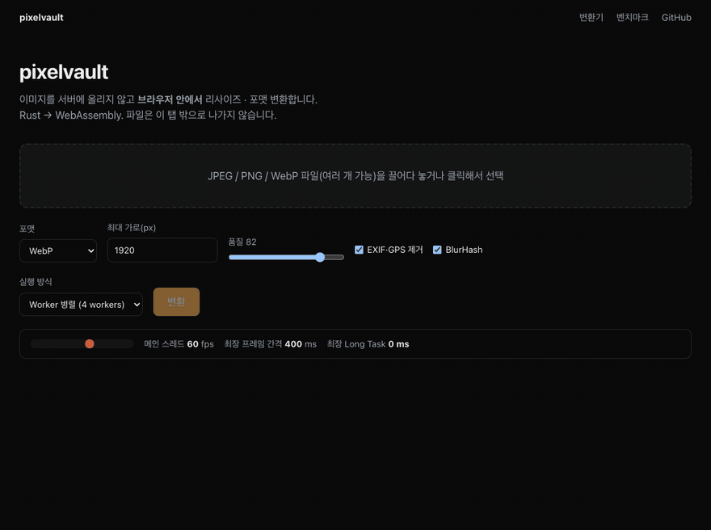

# pixelvault

> 브라우저 안에서 끝나는 이미지 처리 파이프라인 — **Rust → WebAssembly** + Next.js
>
> Resize, convert, strip EXIF and generate BlurHash entirely in the browser. No upload, no server.



이미지를 **서버에 올리지 않고** 브라우저 메모리 안에서 리사이즈 · 포맷 변환 · EXIF 제거 · BlurHash 생성까지 끝냅니다.
서버 비용 · 대역폭 · 프라이버시 문제가 한 번에 사라집니다.

- **데모 사이트**: **https://pixelvault-rouge.vercel.app** — [변환기](https://pixelvault-rouge.vercel.app/) · [벤치마크](https://pixelvault-rouge.vercel.app/bench)
- **npm 패키지**: [`@archibald1948/pixelvault`](packages/pixelvault) — Web Worker 풀 + 타입 포함
- **학습 문서**: [`docs/`](docs/README.md) — 마일스톤별 설계 결정과 Rust 학습 포인트

## 기능

| | |
|---|---|
| 입력 | JPEG · PNG · WebP |
| 출력 | WebP (손실, libwebp) · JPEG (4:2:0, 최적화 허프만) · PNG |
| 리사이즈 | Lanczos3 + WebAssembly SIMD, 비율 유지, 확대 안 함 |
| EXIF | 기본 제거(GPS 포함). **제거 전에 Orientation 을 픽셀에 반영** → 아이폰 세로 사진이 눕지 않음 |
| 색 | ICC 프로파일(Display P3 등) 보존 |
| BlurHash | 옵션으로 생성 + 디코더 제공 |
| 스레드 | Web Worker 풀. `File` 을 워커에서 직접 읽고, 결과는 Transferable 로 복사 없이 반환 |
| 크기 | wasm **407 KB** (gzip) |

```ts
import { createPixelVault } from "@archibald1948/pixelvault";

const vault = createPixelVault();
const result = await vault.process(file, { format: "webp", maxWidth: 1920, blurhash: true });
const blob = new Blob([result.bytes], { type: result.mimeType });
```

## 벤치마크: Canvas API vs WASM

12MP JPEG(4032×3024) → 1920px, 품질 82, 헤드리스 Chrome 152 · Apple Silicon 8코어, 5회 중앙값
(`node bench/browser-bench.mjs` 로 재현, 데모 사이트 `/bench` 에서 직접 실행 가능)

| 포맷 | 방식 | 시간 | 결과 크기 | SSIM* | 메인 스레드 최대 멈춤 |
|---|---|---:|---:|---:|---:|
| WebP | Canvas API | **238 ms** | **87 KB** | 0.961 | 40 ms |
| WebP | **pixelvault** | 476 ms | 103 KB | 0.941 | **4 ms** |
| JPEG | Canvas API | **98 ms** | **201 KB** | 0.970 | 38 ms |
| JPEG | **pixelvault** | 141 ms | 230 KB | 0.953 | **1 ms** |
| PNG | Canvas API | **168 ms** | 4,996 KB | 1.000 | 93 ms |
| PNG | **pixelvault** | 757 ms | **3,871 KB** | 1.000 | **5 ms** |

\* 각 방식 자신의 무손실 리사이즈 결과 대비 SSIM (인코딩으로 잃은 품질)

**솔직한 해석**
- 순수 처리 속도는 Chrome 네이티브 코덱(SIMD 최적화된 C++ + GPU)이 더 빠릅니다. "WASM 이면 무조건 빠르다"는 틀린 기대입니다.
- 대신 pixelvault 는 **메인 스레드를 1~5 ms 만** 씁니다. 여러 장이면 차이가 누적됩니다 — 5장(15.8 MB)을 메인 스레드에서 처리하면 UI 가 **3초** 멈추고, 워커에서는 최대 **34 ms**.
- 결과 용량 차이는 인코더가 아니라 **리사이즈 필터** 때문입니다. 같은 픽셀을 넣으면 두 방식의 용량이 1% 이내로 같습니다. Lanczos3 가 디테일을 더 보존해서 인코딩할 정보가 많은 것.
- 그 밖의 차이: Canvas 는 **Safari 에서 WebP 인코딩 불가**(PNG 로 몰래 대체), EXIF 선택 불가, ICC 프로파일을 버림. pixelvault 는 모든 브라우저에서 같은 결과.

자세한 측정 방법과 함정: [docs/m4-benchmark.md](docs/m4-benchmark.md)

## 아키텍처

```
pixelvault/
├── crates/
│   ├── core/          순수 Rust. 모든 로직. wasm 의존성 0 → 네이티브 cargo test 로 검증 (48 tests)
│   │   └── src/       decode · resize · encode · exif · blurhash · webp_meta · pipeline
│   ├── wasm/          wasm-bindgen 바인딩. 타입 변환만, 로직 없음 (wasm-bindgen-test 4 tests)
│   └── wasm-libc/     wasm32 에서 libwebp(C)가 링크되도록 malloc/qsort 등을 제공하는 최소 libc
├── packages/
│   └── pixelvault/    npm 패키지: TS API + Web Worker 풀(comlink) + wasm
├── www/               Next.js 데모: 변환기(/) + 벤치마크(/bench)
├── bench/             Node 벤치 · 헤드리스 Chrome 벤치 · 결과
├── scripts/           build-wasm · test-wasm · record-demo
└── docs/              마일스톤별 학습 문서
```

```
File ──▶ [Worker] file.arrayBuffer() ──▶ wasm: decode ─▶ resize(Lanczos3) ─▶ orient ─▶ encode(+ICC) ──transfer──▶ main thread
                                              │                                         │
                                         EXIF 파싱(방향·GPS)                        BlurHash
```

**원칙**: 로직은 전부 `core` 에 두고 네이티브에서 테스트합니다. wasm 안에서의 디버깅은 로그가 거의 안 나와서 어렵기 때문입니다.

## 개발

```bash
# 한 번만
rustup target add wasm32-unknown-unknown
rustup component add llvm-tools     # libwebp 를 wasm 으로 묶는 데 필요
cargo install wasm-pack

# Rust
cargo test                                            # core 로직 (네이티브)
cargo clippy --workspace --all-targets -- -D warnings
./scripts/test-wasm.sh                                # wasm 런타임 테스트 (Node)

# 빌드 → 데모
./scripts/build-wasm.sh                               # → pkg/ (링크 검증 + 크기 예산 검사 포함)
(cd packages/pixelvault && npm install && npm run build)
(cd www && npm install && npm run dev)                # http://localhost:3000
```

자세한 셋업: [docs/00-setup.md](docs/00-setup.md)

## 완료 기준 (Definition of Done)

- [x] 10MB JPEG → 1920px WebP 변환 중 메인 스레드 블로킹이 없다 — 9.4MB 24MP 포함 5장 처리 중 메인 스레드 최대 멈춤 34 ms (메인 스레드 처리 시 3,087 ms). [M3](docs/m3-worker.md)
- [x] 출력물에 EXIF GPS 태그가 남아있지 않다 — `gps_is_removed_by_default` 테스트 (WebP/JPEG/PNG 결과를 kamadak-exif 로 다시 읽어 검증)
- [x] 아이폰 세로 사진(Orientation=6)이 눕지 않는다 — `iphone_portrait_is_not_lying_down` 테스트 (3개 포맷, 픽셀 색으로 방향 검증)
- [x] Canvas API 대비 비교표가 README 에 있다 — 위 표
- [x] `.wasm` 파일이 gzip 기준 500KB 이하 — 407 KB, `build-wasm.sh` 가 초과 시 빌드 실패
- [x] `cargo test` 전부 통과, `cargo clippy -- -D warnings` 통과 — 네이티브 + wasm32 타깃 모두

## 문서

| | |
|---|---|
| [00 셋업](docs/00-setup.md) | 툴체인, 명령어, 폴더 구조, Cargo 용어 |
| [M0 파이프라인 뚫기](docs/m0-pipeline.md) | wasm-bindgen, wasm-pack `--target web`, Next.js 에서 로드 |
| [M1 코어 파이프라인](docs/m1-core-pipeline.md) | `&[u8]` vs `Vec<u8>`, 소유권 흐름, `Result`/`?`, SIMD 리사이즈, 제네릭과 wasm 크기 |
| [libwebp on wasm](docs/libwebp-on-wasm.md) | C 라이브러리를 wasm 으로: 최소 libc, llvm-ar, 조용한 링크 실패 |
| [M2 EXIF & BlurHash](docs/m2-exif-blurhash.md) | 사진이 눕는 이유, EXIF/ICC, RIFF 바이트 조립, 라이프타임 |
| [M3 Web Worker](docs/m3-worker.md) | comlink, Transferable, 워커 풀, JS↔Rust 숫자 경계 |
| [M4 벤치마크](docs/m4-benchmark.md) | 측정 방법론, 결과 해석, JPEG 인코더 교체 |
| [M5 패키징 & 배포](docs/m5-packaging.md) | npm 배포, Vercel 배포, CI |
| [Rust 개념 정리](docs/rust-concepts.md) | 이 프로젝트에 나온 Rust 개념 사전 (요약) |
| [**Rust 깊이 읽기**](docs/rust/README.md) | 문법 기초 → 소유권 → 트레잇 → 에러 → unsafe/FFI → wasm-bindgen → **코드 전체 해설** (11장) |

## 라이선스

MIT. wasm 바이너리에는 libwebp(BSD-3-Clause), kamadak-exif(BSD-2-Clause), IJG 코드 일부가 포함됩니다 — [THIRD_PARTY_NOTICES](packages/pixelvault/THIRD_PARTY_NOTICES.md).
